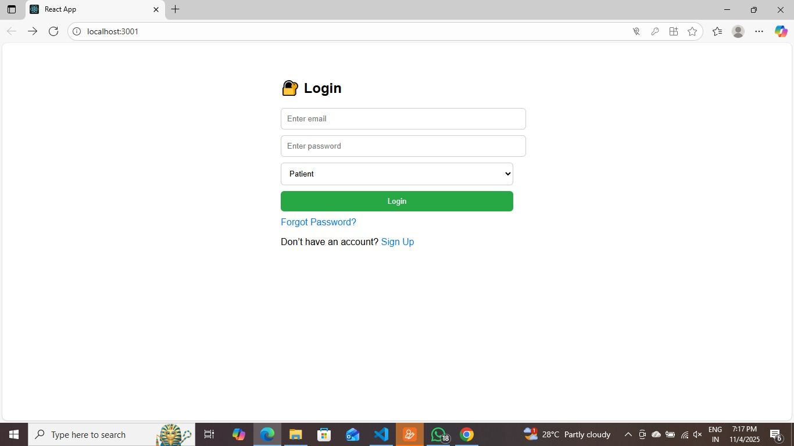
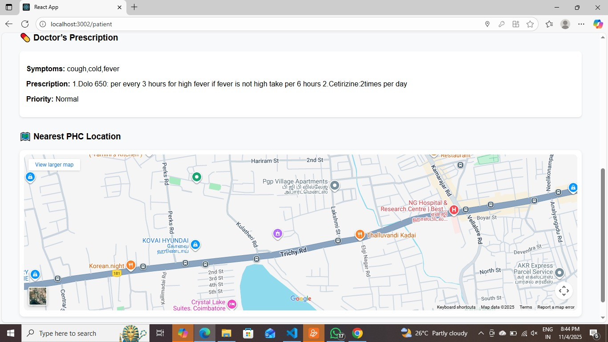
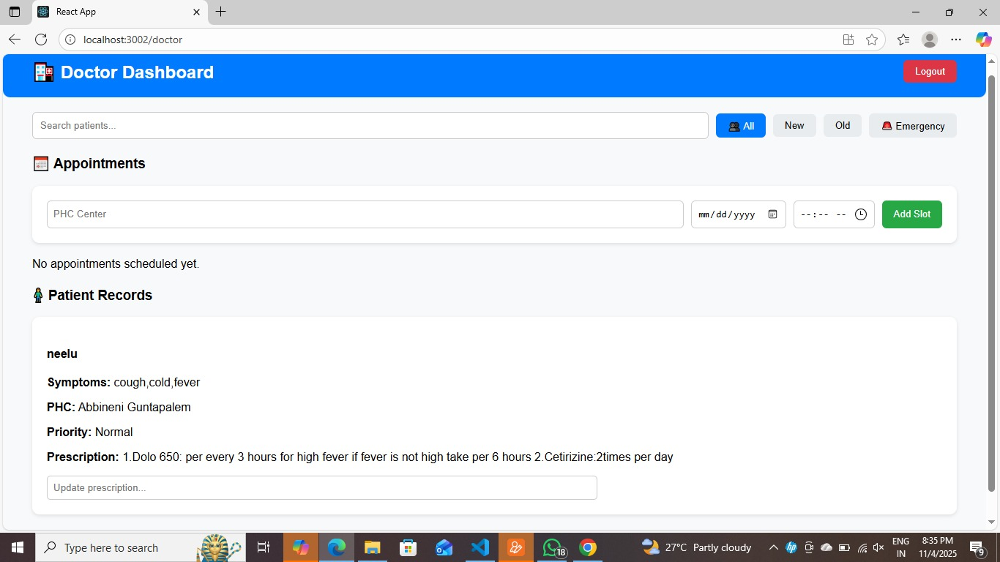
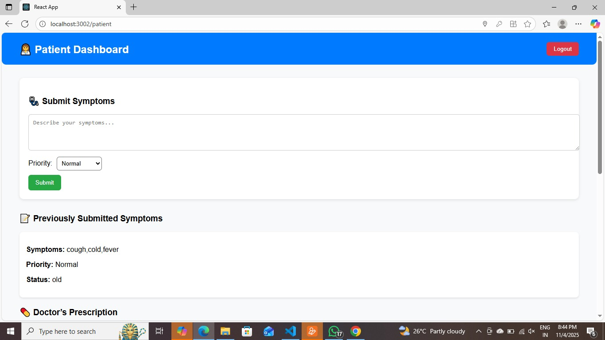

# 🏥 Health Monitor Web

<<<<<<< HEAD
A web-based healthcare management system that helps patients, doctors, and Primary Health Centers (PHCs) manage health records efficiently through a user-friendly interface.

---

## 🚀 Features

- Secure Login System
- Patient Dashboard
- Doctor Dashboard
- PHC Dashboard
- Health Record Management
- Easy Navigation and User Interface

---

## 🛠️ Technologies Used

- React.js
- JavaScript
- HTML5
- CSS3
- Node.js
- Git & GitHub

---

## 📦 Installation

1. Clone the repository

```bash
git clone https://github.com/your-username/health-monitor-web.git
```

2. Navigate to the project directory

```bash
cd health-monitor-web
```

3. Install dependencies

```bash
npm install
```

4. Run the application

```bash
npm start
```

5. Open in browser

```
http://localhost:3000
```

---

## 📸 Screenshots

### Login Page



### Doctor Dashboard


### Patient Dashboard


### PHC Dashboard



---

## 🎯 Project Objectives

- Digitalize healthcare record management
- Improve communication between doctors and patients
- Enable centralized health monitoring
- Provide easy access to medical information

---

## 🔮 Future Enhancements

- Appointment Booking System
- Online Consultation
- Email/SMS Notifications
- AI-Based Health Predictions
- Mobile Application Support

---

## 👩‍💻 Author

**Neelima Deepala**

IoT Student | Full Stack Developer | Healthcare Technology Enthusiast

---
=======
## Overview

Health Monitor Web is a web-based healthcare management system that enables patients, doctors, and PHC administrators to manage health records efficiently.

## Features

* Secure Login System
* Patient Dashboard
* Doctor Dashboard
* PHC Dashboard
* Health Record Management
* User-Friendly Interface

## Technologies Used

* React.js
* JavaScript
* HTML
* CSS
* Node.js

## Installation

### Clone the Repository

```bash
git clone https://github.com/your-username/health-monitor-web.git
```

### Install Dependencies

```bash
npm install
```

### Run the Application

```bash
npm start
```

Open http://localhost:3000 in your browser.

## Screenshots

### Login Page


### Doctor Dashboard



### Patient Dashboard



### PHC Dashboard


## Future Enhancements

* Appointment Booking
* Online Consultation
* Email Notifications
* Mobile Application

## Author

**Neelima Deepala**

IoT Student | Full Stack Developer
>>>>>>> 049bbc174b950ac8aaf987a6e3751a8910458630
